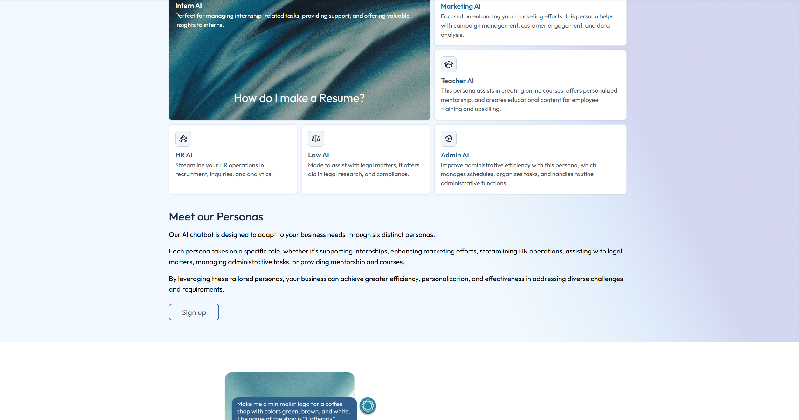
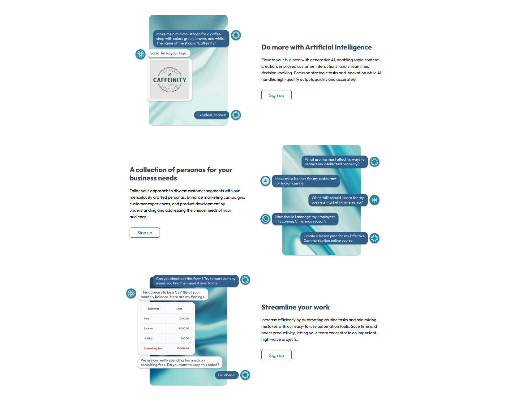
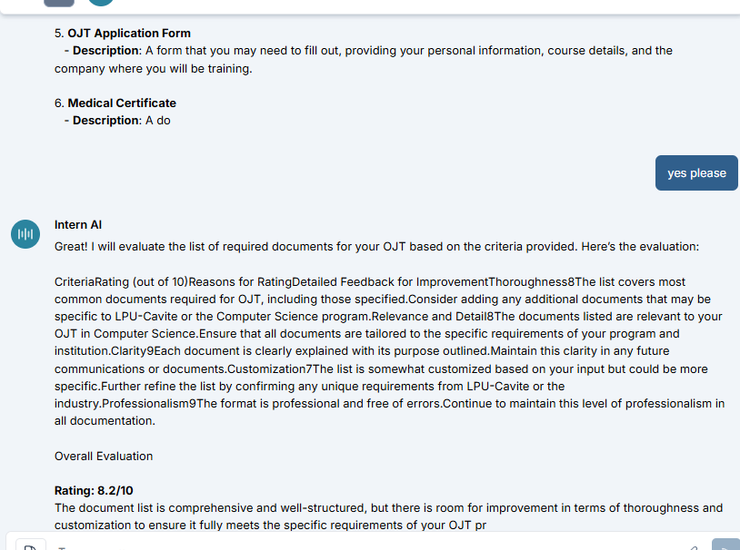
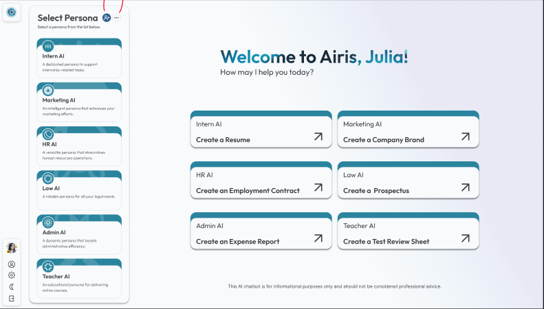
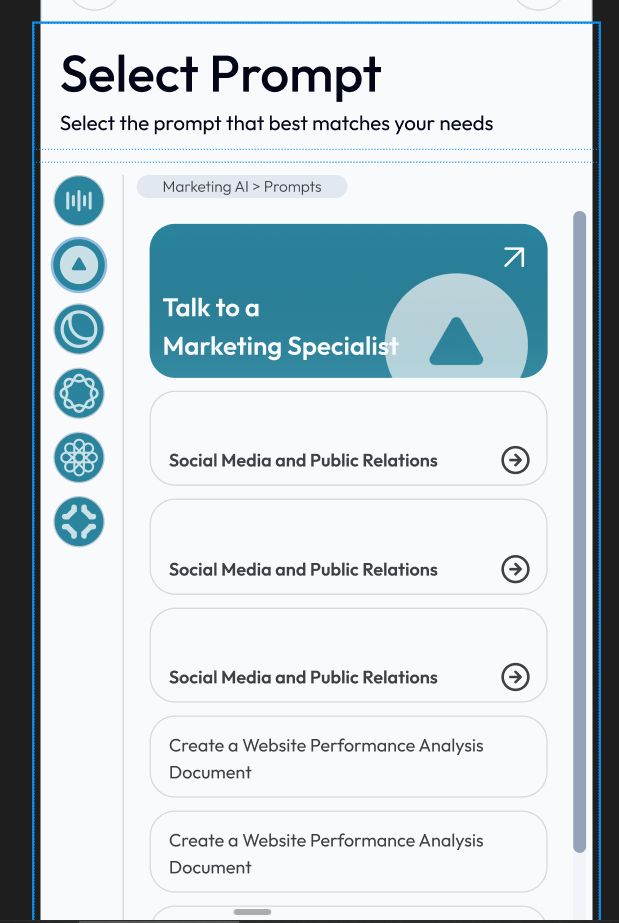
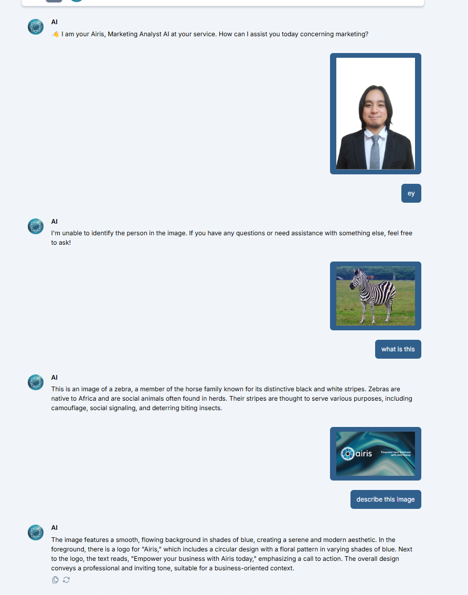

---

# AIris

**AIris** is an advanced AI chatbot platform designed for personalized and creative digital interactions. It supports multiple **specialized personas**, image generation via **DALL·E**, and persistent chat history to maintain user context.  

The platform was built to demonstrate the versatility of AI in handling various professional and educational scenarios, offering tailored assistance to users depending on their needs.

---

## 🎯 Objectives
- To provide a conversational AI platform with distinct specialized roles.  
- To integrate text-based conversations with AI-powered image generation.  
- To store chat history for enhanced continuity and usability.  

---

## ✨ Key Features
- **Multiple Personas**: Choose from predefined personas such as HR assistant, marketing advisor, or student mentor.  
- **Image Generation**: Generate visuals from text prompts using DALL·E.  
- **Stored Chat History**: Conversations are saved for future reference.  
- **Modern Frontend**: Built with React and Next.js for scalability.  

---

## 📸 Screenshots

> **Note:** The screenshots below contain *sample data* only.  
> Actual data in the live system may differ.










---

## 🛠 Technologies Used
- **Frontend**: HTML, CSS, JavaScript, React.js, Next.js  
- **Database**: PostgreSQL  
- **AI Integration**: OpenAI GPT & DALL·E APIs  

---

## 🚀 Installation & Setup
1. Clone the repository:  
   ```bash
   git clone https://github.com/yourusername/airis.git
